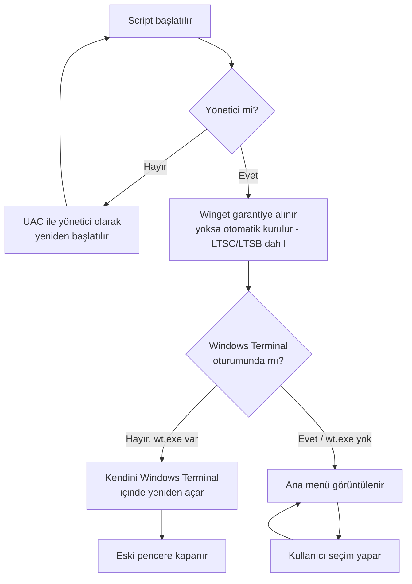

<div align="center">

# 🖥️ Bilgisayar Aracı

**Windows için hepsi-bir-arada sistem bakım aracı**
Tek PowerShell script'i. Kurulum yok, bağımlılık yok, sadece çalıştır.

Uygulama Kurulumu • Güncelleme • Sürücü Yedekleme • Temizlik • Onarım • Tanılama

[]()
[]()
[]()
[]()

**Hazırlayan:** Mehmet IŞIK

</div>

---

## 🎬 Önizleme


---

## 🛡️ Güvenlik: `irm | iex` Ne Yapar?

Aşağıdaki komut, script'i **doğrudan bu depodaki `Bilgisayar_Araci.ps1`'den** indirip belleğe alır ve çalıştırır; diske dosya yazmaz.

```powershell
irm https://tinyurl.com/27kxfp7y | iex
```

Kısaltılmış bağlantı, GitHub'ın ham dosya adresine yönlenir; isterseniz uzun adresi doğrudan kullanabilir ya da çalıştırmadan önce dosyayı inceleyebilirsiniz:

```powershell
irm https://raw.githubusercontent.com/mhmtsk44/bilgisayar-araci/refs/heads/main/Bilgisayar_Araci.ps1 | iex
```

---

## 🚀 Kurulum

### Yöntem 1 — Tek Satır *(önerilen)*

Yönetici PowerShell açıp şunu yapıştırın:

```powershell
irm https://tinyurl.com/27kxfp7y | iex
```

`ExecutionPolicy` ayarına takılmaz, dosya kaydetmez, encoding sorunu yaşanmaz.

### Yöntem 2 — Yerel Dosya

1. Projeyi **zip olarak indirin** ve Masaüstüne çıkarın (klasör adı: `bilgisayar-araci-main`).
2. Türkçe karakterlerin ve çerçeve simgelerinin bozuk görünmemesi için dosyayı UTF-8 BOM'a çevirin:
   ```powershell
   $p = "$env:USERPROFILE\Desktop\bilgisayar-araci-main\Bilgisayar_Araci.ps1"; [IO.File]::WriteAllText($p, (Get-Content $p -Raw -Encoding UTF8), [Text.UTF8Encoding]::new($true))
   ```
3. `Bilgisayar_Araci.ps1` dosyasına **sağ tık → "PowerShell ile çalıştır"**.
4. Script kendini otomatik olarak **yönetici** yetkisiyle ve (varsa) **Windows Terminal**'de yeniden başlatır.

> ⚠️ **2. adımı atlamayın:** BOM'suz `.ps1` dosyaları Windows PowerShell 5.1'de sistem kod sayfasıyla okunur, Türkçe karakterler bozuk görünür.

**ExecutionPolicy** *(yalnızca yerel dosya için, tek seferlik)*:

```powershell
Set-ExecutionPolicy RemoteSigned -Scope CurrentUser
```

`-Scope CurrentUser` sayesinde yönetici gerekmez ve kalıcıdır; yerel script'lere izin verirken internetten inen imzasız script'leri engellemeye devam eder. Yöntem 1'i kullanıyorsanız bu adıma gerek yoktur. "Engellendi" uyarısı alırsanız: `Unblock-File .\Bilgisayar_Araci.ps1`

---

## ⚙️ Çalışma Mantığı



Sonsuz döngüye girmemesi için `BILGISAYAR_ARACI_WT` ortam değişkeni bayrak olarak kullanılır.

---

## ✨ Öne Çıkan Mühendislik Detayları

| | |
|---|---|
| 🔐 **Otomatik yönetici yükseltme** | UAC penceresiyle kendini yönetici olarak yeniden başlatır |
| 🖥️ **Windows Terminal'e otomatik geçiş** | `wt.exe` kuruluysa daha iyi Unicode/renk desteği için otomatik açılır |
| 📦 **Winget'i otomatik kurma** | Sistemde yoksa resmi yöntemle, olmazsa manuel MSIX yedek yöntemiyle kurar |
| 🏢 **LTSC / LTSB desteği** | Bu sürümlerde winget kurulumu için özel akış |
| 🧩 **Microsoft.WinGet.Client modülü** | "Uygulamaları Güncelle" için gerektiğinde otomatik yüklenir (metin ayrıştırma yok) |
| ✍️ **Dijital imza doğrulaması** | Winget dışı kurulan Alpemix'in indirilen dosyası otomatik kontrol edilir |
| 📝 **Ayrıntılı loglama** | Her oturum `%TEMP%\winget-kurulum.log` dosyasına kaydedilir |
| 🔁 **Yeniden deneme korumalı indirme** | Ağ dalgalanmalarına karşı otomatik tekrar deneme |

## 📦 Özellikler

**Uygulama Yönetimi**
- Hazır listeden toplu uygulama kurulumu (winget tabanlı)
- Uygulamaları güncelleme (seçmeli veya toplu)
- Uygulama arama, kurma, kaldırma
- Uygulama listesini dışa/içe aktarma

**Temizlik**
- Standart Disk Temizliği (`cleanmgr`)
- Derin Sistem Temizliği, kategori seçmeli (Temp/Prefetch, tarayıcı önbelleği, Windows Update önbelleği, GPU kurulum artıkları, Geri Dönüşüm Kutusu, olay günlükleri)
- Yazıcı kuyruğu temizliği

**Sürücü İşlemleri**
- Sürücü yedekleme (export)
- Yedekten sürücü geri yükleme

**Bakım**
- Sistem ve disk onarımı: SFC, DISM, chkdsk, Tam Sistem Onarımı
- Güvenli/korumalı USB oluşturma
- Disk temizle ve dönüştür (GPT/MBR): seri numarasıyla disk seçimi, sistem diski koruması, yazılı onay (`SIL <disk no>`)
- Windows güncellemelerini tarama, ağ ayarlarını sıfırlama, sistem geri yükleme noktası oluşturma

**Bilgi & Tanılama**
- Sistem bilgileri, disk özeti, disk sağlığı (SMART), başlangıç programları, sistem sağlık özeti

**Diğer**
- Yönetim klasörleri oluşturma, yardım/hakkında

---

## 📋 Gereksinimler

| Gereksinim | Açıklama |
|---|---|
| **İşletim Sistemi** | Windows 10 (1809+) / Windows 11 |
| **PowerShell** | 5.1+ (Windows'ta yerleşik) |
| **Yetki** | Yönetici (script otomatik yükseltir) |
| **Winget** | Yoksa script otomatik kurmayı dener (LTSC uyumlu); kurulamazsa winget gerektirmeyen özellikler (temizlik, bilgi, bakım) çalışmaya devam eder |
| **PowerShell Modülü** | "Uygulamaları Güncelle" için `Microsoft.WinGet.Client`, ilk kullanımda otomatik kurulur |
| **İnternet** | Uygulama kurulumu/güncelleme için gerekli |

---

## 🧩 Kurulan Uygulama Listesi

| # | Uygulama | # | Uygulama |
|---|---|---|---|
| 1 | Google Chrome | 9 | Visual Studio Code |
| 2 | WinRAR | 10 | UniGetUI |
| 3 | ACS Unified PC/SC Driver | 11 | PowerToys |
| 4 | Adobe Reader | 12 | PowerShell 7 |
| 5 | Internet Download Manager | 13 | Oracle Java Runtime |
| 6 | Mozilla Firefox | 14 | Microsoft PC Manager *(Store)* |
| 7 | VLC Media Player | 15 | Windows Terminal |
| 8 | Notepad++ | 16 | Alpemix *(Uzak Bağlantı)* |

> Tam liste script içindeki `$Uygulamalar` dizisinden yönetilir. **Microsoft PC Manager** `msstore` kaynağından kurulur; **Alpemix** winget'te olmadığı için `alpemix.com`'dan indirilir ve dijital imzası otomatik doğrulanır.

---

## 🗂️ Menü Düzeni

<table>
<tr><th colspan="2">📦 Uygulama Yönetimi</th></tr>
<tr><td>01</td><td>Uygulama Kurulumu (liste)</td></tr>
<tr><td>02</td><td>Uygulamaları Güncelle</td></tr>
<tr><td>03</td><td>Uygulama Ara / Kaldır ↳ <i>1) Ara ve Kur (winget) · 2) Kaldır</i></td></tr>
<tr><td>04</td><td>Uygulama Listesi Dışa/İçe Aktar</td></tr>
<tr><th colspan="2">🛠️ Bakım</th></tr>
<tr><td>05</td><td>Sistem ve Disk Onarımı ↳ <i>SFC · DISM · chkdsk · Tam Sistem Onarımı</i></td></tr>
<tr><td>06</td><td>Disk Temizle ve Dönüştür (GPT/MBR)</td></tr>
<tr><td>07</td><td>Güvenli USB Oluştur (Korumalı)</td></tr>
<tr><td>08</td><td>Windows Güncellemelerini Tara</td></tr>
<tr><td>09</td><td>Ağ Ayarlarını Sıfırla</td></tr>
<tr><td>10</td><td>Geri Yükleme Noktası Oluştur</td></tr>
<tr><th colspan="2">🧹 Temizlik</th></tr>
<tr><td>11</td><td>Sistem Temizliği ↳ <i>1) Standart Disk Temizliği (cleanmgr) · 2) Derin Sistem Temizliği (kategori seçmeli)</i></td></tr>
<tr><td>12</td><td>Yazıcı Kuyruğunu Temizle</td></tr>
<tr><th colspan="2">💾 Sürücü İşlemleri</th></tr>
<tr><td>13</td><td>Sürücü Yönetimi ↳ <i>1) Sürücü Yedekle · 2) Sürücü Geri Yükle</i></td></tr>
<tr><th colspan="2">📊 Bilgi & Tanılama</th></tr>
<tr><td>14</td><td>Sistem Bilgileri ↳ <i>1) Sistem Bilgileri · 2) Disk Özeti · 3) Disk Sağlığı (SMART) · 4) Başlangıç Programları · 5) Sistem Sağlık Özeti</i></td></tr>
<tr><th colspan="2">⚙️ Diğer</th></tr>
<tr><td>15</td><td>Yönetim Klasörleri Oluştur</td></tr>
<tr><td>16</td><td>Yardım / Hakkında</td></tr>
<tr><td>00</td><td>Çıkış</td></tr>
</table>

---

## ❓ Sık Sorulan Sorular

**Script neden yönetici izni istiyor?**
Winget kurulumu, disk/sürücü işlemleri ve ağ sıfırlama gibi çoğu özellik yönetici yetkisi gerektirir; script bunu otomatik yükseltir.

**Windows Terminal zorunlu mu?**
Hayır. Kurulu değilse araç normal PowerShell konsolunda çalışır; sadece görünüm Windows Terminal'de daha düzgün olur.

**Winget kurulamazsa ne olur?**
Araç çökmez; sadece winget gerektiren menüler devre dışı kalır, geri kalan tüm özellikler çalışmaya devam eder.

**Verilerim/parolalarım siliniyor mu?**
Hayır. Tarayıcı temizliği yalnızca önbellek ve geçmişi hedefler, şifrelere dokunmaz. Geri döndürülemez işlemler (disk temizle/dönüştür) ayrı, açık onaylı bir menüde sunulur.

**Türkçe karakterler bozuk görünüyor, neden?**
Yerel dosyayı UTF-8 BOM'a çevirmeyi atlamış olabilirsiniz (bkz. Kurulum, Yöntem 2). `irm | iex` ile bu sorun hiç yaşanmaz.

---

## 🔄 Sürüm Geçmişi

| Tarih | Not |
|---|---|
| **14.07.2026** | Kararlılık ve kod kalitesi iyileştirmeleri |
| **07.07.2026** | Belgelenen ilk sürüm |

---

## 🤝 Katkıda Bulunma

1. Hata/öneri için bir **Issue** açın (mümkünse `%TEMP%\winget-kurulum.log` ile birlikte).
2. Kod değişikliği için depoyu **fork'layın** ve **Pull Request** gönderin.
3. `.ps1` dosyasını **UTF-8 BOM** ile kaydedin (aksi halde Türkçe karakterler bozulur).

Yeni uygulama eklemek için `$Uygulamalar` dizisine `@{ No = ...; Ad = "..."; Id = "..." }` satırı eklemeniz yeterli.

---

## ⚠️ Uyarı

- Bu araç **sistem düzeyinde** değişiklikler yapar (disk onarımı, ağ sıfırlama, sürücü işlemleri).
- Kritik işlemlerden (chkdsk, sürücü geri yükleme, USB oluşturma, disk temizle/dönüştür) önce **veri yedeği** alın.
- Yalnızca **kendi bilgisayarınızda** veya yetkiniz olan cihazlarda kullanın.
- USB oluşturma ve **"Disk Temizle ve Dönüştür"** hedef diskteki **tüm verileri siler**.

---

<div align="center">

**Mehmet IŞIK**

Kişisel kullanım içindir. Serbestçe dağıtılabilir; sorumluluk kullanıcıya aittir.

</div>
